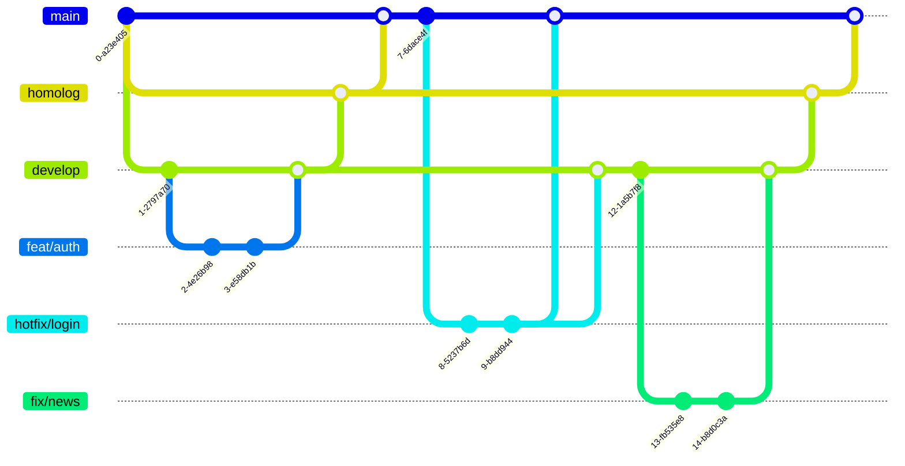
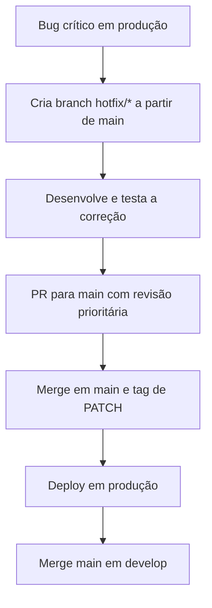

# Política de Versionamento e Fluxo de Trabalho

- [Política de Versionamento e Fluxo de Trabalho](#política-de-versionamento-e-fluxo-de-trabalho)
  - [Objetivo](#objetivo)
  - [Versionamento com SemVer](#versionamento-com-semver)
  - [Padrão de Commits](#padrão-de-commits)
  - [Change Log](#change-log)
  - [Fluxo de Trabalho](#fluxo-de-trabalho)
    - [Desenvolvimento e Testes](#desenvolvimento-e-testes)
    - [Homologação (_Staging_)](#homologação-staging)
    - [Produção](#produção)
    - [Tratamento de _Hotfixes_](#tratamento-de-hotfixes)
      - [Fluxograma do _Hotfix_](#fluxograma-do-hotfix)
      - [Boas Práticas](#boas-práticas)
    - [Versionamento](#versionamento)
      - [Patches](#patches)
      - [Minor](#minor)
      - [Major](#major)
      - [Homologação](#homologação)
      - [Produção](#produção-1)
      - [_Hotfix_](#hotfix)
  - [Contribuição externa](#contribuição-externa)
  - [Automação](#automação)
    - [CI/CD](#cicd)
    - [Ferramentas](#ferramentas)

## Objetivo

Esta política define as regras de versionamento do Portal em
**SemVer**[^semver] e padrões de commit (**_Conventional Commits_**[^convcom]),
além de estabelecer fluxos de trabalho para testes, homologação e produção. Os
principais objetivos são garantir rastreabilidade, versionamento consistente e
alinhamento entre equipes de desenvolvimento e operações.

## Versionamento com SemVer

O versionamento segue o padrão `MAJOR.MINOR.PATCH`:

- MAJOR (X.0.0): Mudanças incompatíveis com versões anteriores
  (_breaking changes_).
- MINOR (0.Y.0): Novas funcionalidades compatíveis com versões anteriores.
- PATCH (0.0.Z): Correções de bugs e pequenos ajustes sem quebrar
  compatibilidade.

Exemplos:

- `1.0.0` → Primeira versão estável.
- `1.1.0` → Adição de uma nova funcionalidade (_feature_).
- `1.1.1` → Correção de um bug.
- `2.0.0` → _Breaking change_.

## Padrão de Commits

Os commits devem seguir o formato:

```
<tipo>[escopo(opcional)]: <descrição>

[corpo(opcional)]

[rodapé(opcional)]
```

Tipos de commit:

- `feat`: Nova funcionalidade (MINOR).
- `fix`: Correção de bug (PATCH).
- `chore`: Tarefas de manutenção (não afeta versionamento).
- `docs`: Alterações na documentação (não afeta versionamento).
- `style`: Formatação de código (não afeta versionamento).
- `refactor`: Refatoração sem mudança de comportamento (PATCH).
- `perf`: Melhoria de performance (PATCH).
- `test`: Adição/ajuste de testes (não afeta versionamento).
- `build`: Alterações no build (pode afetar a versão de build)
- `ci`: Alterações no pipeline de CI/CD (não afeta versionamento).
- `revert`: Reverte um commit (não afeta versionamento).
- `BREAKING CHANGE`: Indica mudança incompatível (MAJOR).

Exemplos:

- ```bash
  feat(api): add user authentication endpoint
  ```
- ```bash
  fix(login): correct password validation logic
  ```
- ```bash
  chore(deps): update axios to v1.0.0

  BREAKING CHANGE: remove deprecated API endpoints
  ```

## Change Log

Todas as alterações significativas neste projeto serão documentadas no
[Change Log](../CHANGELOG.md).

O formato é baseado em **Keep a Changelog**[^changelog].

## Fluxo de Trabalho

O repositório possui 3 branches principais, com as seguinte características:

- `main`: contém código de produção
  - Pode ter branches de _hotfixes_.
- `develop`: contém código em fase de desenvolvimento
  - Pode ter branches de _features_, correções ou tarefas de manutenção.
- `homolog`: contém código em fase de homologação (pré produção)

```
.
├── main
│   └── hotfix/login-security
├── develop
│   ├── feat/auth
│   ├── fix/nasty-bug
│   └── task/sanitize-repo
└── homolog
```

Considerações sobre como nomear branches:

- **Importante**: **Todos** os branches devem estar associados a uma issue
  devidamente registrada.
- Evite usar acentuação no nome dos branches.
- Idealmente, o número da issue deve ser referenciado no nome do branch (ex.:
  `feat/7-auth`).
- Procure utilizar o prefixo do tipo de issue no nome do branch:
  - `feat/*`: Para branches de melhoria
  - `fix/*`: Para branches de correção de bugs
  - `task/*`: Para tarefas (_tasks_) de manutenção (normalmente são alterações
    que não modificam arquivos fonte nem testes)

Visualização do fluxo:



> [!IMPORTANT]
> Este fluxo de trabalho, versionamento e commits aplicam-se tanto para o
> desenvolvimento do backend quanto do frontend do Portal.

### Desenvolvimento e Testes

Correções e novas funcionalidades em fase de desenvolvimento ou testes devem
ser **sempre** realizados localmente de forma a garantir que os testes
automatizados não falhem.

- Branches:
  1. `feat/*` ou `fix/*` (baseada no tipo de alteração).
  2. Os branches devem ser sempre criados a partir do branch `develop`.
- Processo:
  1. Commits seguem Conventional Commits.
  2. Merge de `feat/*` ou `fix/*` para `develop`.
  3. Pull Requests (PRs) são revisados e exigem aprovação.
  4. Testes automatizados (CI) devem passar.

### Homologação (_Staging_)

Melhorias e correções que devam passar por homologação do PO e/ou stakeholders.
Uma versão de Pré-Lançamento (_pre-release_) de homologação indica que a versão
é instável e pode não satisfazer os requisitos de compatibilidade pretendidos,
como indicado por sua versão normal associada.

- Branch: `homolog` (integração de _features_).
- Processo:
  1. Merge de `develop` para `homolog` via PR.
  2. Pull Requests (PRs) são revisados e exigem aprovação.
  3. Tag da versão pré-lançamento seguindo SemVer (`1.1.0-homolog`, `1.1.0-homolog.1`).
  4. Versão de build (`1.1.0-homolog+001`, `1.1.0-homolog+20250624174000`)
     pode ser usada (para uma versão somente com alterações no processo de
     build, não no código da aplicação).
  5. Atualização da tag `homolog` para a nova versão.
  6. Deploy em ambiente de homologação para validação.

### Produção

- Branch: `main` (versões estáveis).
- Processo:
  1. Merge de `develop` para `main` via PR.
  2. Pull Requests (PRs) são revisados e exigem aprovação.
  3. Tag da versão seguindo SemVer (`1.1.0`).
  4. Atualização da tag `latest` para a nova versão.
  5. Deploy em produção.

### Tratamento de _Hotfixes_

Em um cenário onde _hotfixes_ (correções emergenciais para bugs críticos em
produção) são necessários, é importante ter um fluxo ágil e seguro para evitar
impactos no ambiente produtivo. _Hotfixes_ não podem esperar pelo ciclo normal
de desenvolvimento e devem ser aplicados quando há um problema grave (ex.:
vulnerabilidade, falha que impede o funcionamento básico).

- Branch: `hotfix/*` (ex.: `hotfix/login-security`).
  - Derivada do `main` (versão atual em produção).
  - Nunca derivar de `develop`, pois pode conter _features_ não estáveis.
- Desenvolvimento e Commit
  - Commits devem seguir Conventional Commits (ex.: `fix(login): patch xss vulnerability`).
  - Se o _hotfix_ introduzir uma BREAKING CHANGE, ele deve ser evitado (caso extremo, vira uma MAJOR release).
  - Testes locais e automatizados devem ser executados.
- Revisão e Aprovação
  - Pull Request (PR) para `main` com revisão prioritária.
  - Aprovação obrigatória de pelo menos um maintainer.
- Merge e Versionamento

  1. Merge em `main`:

      ```bash
      git checkout main
      git merge --no-ff hotfix/login-security
      git tag v1.0.1 # Incremento PATCH (SemVer)
      git push origin main --tags
      ```

  2. Atualização do `develop` deve evitar divergência entre `main` e `develop`:

      ```bash
      git checkout develop
      git merge main
      ```

- Deploy Imediato
  - Prioridade:
  - Deploy em produção assim que aprovado.
  - Pode pular homologação se o risco for baixo (ex.: correção simples e testada).

#### Fluxograma do _Hotfix_



#### Boas Práticas

- Teste rigoroso: _Hotfixes_ não podem introduzir novos bugs.
- Documentação: Registrar no CHANGELOG.md (ex.: "Fixed security vulnerability in login").
- Comunicação: Notificar stakeholders sobre o _hotfix_.
- Evitar:
  - _Hotfixes_ para _features_ não lançadas.
  - Quebrar compatibilidade (a menos que seja crítico).

### Versionamento

#### Patches

- Regra: PRs para o branch develop sempre incrementam o PATCH quando houver
  pelo menos um commit do tipo:
  - `fix`: Correção de bug.
  - `refactor`: Refatoração sem mudança de comportamento.
  - `perf`: Melhoria de performance.

#### Minor

- Regra: PRs para o branch `develop` sempre incrementam o MINOR quando houver
  pelo menos um commit do tipo:
  - `feat`: Nova funcionalidade.

#### Major

- Regra: PRs para o branch `develop` sempre incrementam o MAJOR quando houver
  pelo menos um commit do tipo:
  - `BREAKING CHANGE`: Indica mudança incompatível.

#### Homologação

- Regra: PRs para o branch `homolog` não incrementam versões, mas deve ser
  adicionada uma tag na versão atual (ex.: `1.1.0` no `develop` →
  `1.1.0-homolog`).
- A tag `homolog` deve ser atualizada para apontar para a nova versão.
- Deve gerar um build da imagem (backend ou frontend) com a nova versão.
  - `build`: Alterações no build pode gerar uma nova versão de build

> [!IMPORTANT]
> A tag `homolog` aponta **sempre** para a última versão do `homolog`.

#### Produção

- Regra: PRs para o branch `main` não incrementam versões.
- Versões homologadas são promovidas para produção, sem _bump_ de versão.
- A tag `latest` deve ser atualizada para apontar para a nova versão.

> [!IMPORTANT]
> A tag `latest` aponta **sempre** para a última versão do `main`.

#### _Hotfix_

- Regra: Sempre incrementar PATCH (ex.: `1.0.0` → `1.0.1`).
- Se o _hotfix_ exigir uma MAJOR (raro), versionar como `2.0.0`.

| Situação                   | Exemplo de Versão Antes | Nova Versão       |
| -------------------------- | ----------------------- | ----------------- |
| Correção crítica           | `1.0.0`                 | `1.0.1` (hotfix)  |
| Hotfix com breaking change | `1.0.0`                 | `2.0.0` (evitar!) |

> [!IMPORTANT]
> _Hotfixes_ não devem conter _breaking changes_ a menos que seja absolutamente
> necessário.

## Contribuição externa

De acordo com nossas [diretrizes](./CONTRIBUTING.md), faça um **fork**
do repositório para enviar suas sugestões ou correções.

Regras importantes:

- Adicione suas modificações seguindo o padrão descrito neste documento.
- Certifique-se de que os testes passem.
- Mantenha o PR focado em uma única mudança.
- Descreva claramente o que seu PR faz e referencie a issue relacionada (PRs
  não relacionados a nenhuma issue poderão ser descartados).

## Automação

### CI/CD

- Incremento de versão via `standard-version` ou `semantic-release`.
- Verificação automática de Conventional Commits.
- Geração automática de changelog baseado em commits.
- Pipeline específico para _hotfixes_ (deploy rápido em produção).

### Ferramentas

- `semantic-release` (gera versão e changelog automaticamente).
- Validação de mensagens de commit (`husky`[^husky_hook][^padronizacao_commit] +
  `commitlint`[^commitlint][^commitlint_repo]).

[^semver]: [Semantic Versioning (SemVer)](https://semver.org/)
[^convcom]: [Conventional Commits](https://www.conventionalcommits.org/)
[^changelog]: [Keep a Changelog](http://keepachangelog.com/)
[^husky_hook]: [Guide: Local setup | commitlint](https://commitlint.js.org/guides/local-setup.html)
[^padronizacao_commit]: [Padronização de commit com (Commitlint, Husky e Commitizen)](https://dev.to/vitordevsp/padronizacao-de-commit-com-commitlint-husky-e-commitizen-3g1n)
[^commitlint_repo]: [commitlint](https://github.com/conventional-changelog/commitlint)
[^commitlint]: [Lint commit messages](https://commitlint.js.org/)
