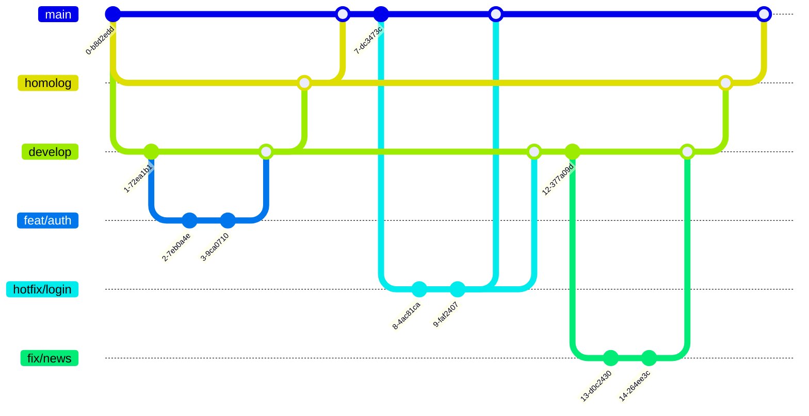

# Política de Versionamento e Fluxo de Trabalho

## Objetivo

Esta política define as regras de versionamento do Portal em
**SemVer**[^semver] e padrões de commit (**_Conventional Commits_**[^convcom]),
além de estabelecer fluxos de trabalho para testes, homologação e produção. Os
principais objetivos são garantir rastreabilidade, versionamento consistente e
alinhamento entre equipes de desenvolvimento e operações.

## Versionamento com SemVer

O versionamento segue o padrão `MAJOR.MINOR.PATCH`:

- MAJOR (X.0.0): Mudanças incompatíveis com versões anteriores
  (_breaking changes_).
- MINOR (0.Y.0): Novas funcionalidades compatíveis com versões anteriores.
- PATCH (0.0.Z): Correções de bugs e pequenos ajustes sem quebrar
  compatibilidade.

Exemplos:

- `1.0.0` → Primeira versão estável.
- `1.1.0` → Adição de uma nova funcionalidade (_feature_).
- `1.1.1` → Correção de um bug.
- `2.0.0` → _Breaking change_.

## Padrão de Commits (_Conventional Commits_)

Os commits devem seguir o formato:

```
<tipo>[escopo(opcional)]: <descrição>

[corpo(opcional)]

[rodapé(opcional)]
```

Tipos de commit:

- `feat`: Nova funcionalidade (MINOR).
- `fix`: Correção de bug (PATCH).
- `chore`: Tarefas de manutenção (PATCH).
- `docs`: Alterações na documentação (não afeta versionamento).
- `style`: Formatação de código (não afeta versionamento).
- `refactor`: Refatoração sem mudança de comportamento (PATCH).
- `perf`: Melhoria de performance (PATCH).
- `test`: Adição/ajuste de testes (não afeta versionamento).
- `BREAKING CHANGE`: Indica mudança incompatível (MAJOR).

Exemplos:

- ```bash
  feat(api): add user authentication endpoint
  ```
- ```bash
  fix(login): correct password validation logic
  ```
- ```bash
  chore(deps): update axios to v1.0.0
  
  BREAKING CHANGE: remove deprecated API endpoints
  ```

## Fluxo de Trabalho

O repositório possui 3 branches principais, com as seguinte características:

- `main`: contém código de produção
  - Pode ter branches de hotfixes
- `develop`: contém código em fase de desenvolvimento
  - Pode ter branches de _features_ ou correções
- `homolog`: contém código em fase de homologação (pré produção)

```
.
├── main
│   └── hotfix/login-security
├── develop
│   ├── feat/auth
│   └── fix/nasty-bug
└── homolog
```

> [!IMPORTANT]
> **Todos** os branches deve estar associado a uma issue devidamente registrada.
> Idealmente, o número da issue deve ser referenciado no nome do branch.

Visualização do fluxo:



### Desenvolvimento e Testes

Desenvolvimento e testes de correções e novas funcionalidades devem ser
**sempre** realizados localmente de forma a garantir que os testes
automatizados não falhem.

- Branches:
  1. `feat/*` ou `fix/*` (baseada no tipo de alteração).
  2. Os branches devem ser sempre criados a partir do branch `develop`.
- Processo:
  1. Commits seguem Conventional Commits.
  2. Merge de `feat/*` ou `fix/*` para `develop`.
  3. Pull Requests (PRs) são revisados e exigem aprovação.
  4. Testes automatizados (CI) devem passar.

### Homologação (Staging)

Melhorias e correções que devam passar por homologação do PO e/ou stakeholders.
Uma versão de Pré-Lançamento (pre-release) de homologação indica que a versão é
instável e pode não satisfazer os requisitos de compatibilidade pretendidos,
como indicado por sua versão normal associada.

- Branch: `homolog` (integração de _features_).
- Processo:
  1. Merge de `develop` para `homolog` via PR.
  2. Pull Requests (PRs) são revisados e exigem aprovação.
  3. Tag da versão pré-lançamento seguindo SemVer (`1.1.0-homolog`, `1.1.0-homolog.1`).
  4. Versão de build (`1.1.0-homolog+001`, `1.1.0-homolog+20250624174000`)
     pode ser usada (para uma versão somente com alterações no processo de
     build, não no código da aplicação).
  5. Atualização da tag `homolog` para a nova versão.
  6. Deploy em ambiente de homologação para validação.

### Produção

- Branch: `main` (versões estáveis).
- Processo:
  1. Merge de `develop` para `main` via PR.
  2. Pull Requests (PRs) são revisados e exigem aprovação.
  3. Tag da versão seguindo SemVer (`1.1.0`).
  4. Atualização da tag `latest` para a nova versão.
  5. Deploy em produção.

### Tratamento de Hotfixes

Em um cenário onde hotfixes (correções emergenciais para bugs críticos em produção) são necessários, é importante ter um fluxo ágil e seguro para evitar impactos no ambiente produtivo. Hotfixes não podem esperar pelo ciclo normal de desenvolvimento e devem ser aplicados quando há um problema grave (ex.: vulnerabilidade, falha que impede o funcionamento básico).

- Branch: `hotfix/*` (ex.: `hotfix/login-security`).
  - Derivada do `main` (versão atual em produção).
  - Nunca derivar de `develop`, pois pode conter _features_ não estáveis.
- Desenvolvimento e Commit
  - Commits devem seguir Conventional Commits (ex.: `fix(login): patch xss vulnerability`).
  - Se o hotfix introduzir uma BREAKING CHANGE, ele deve ser evitado (caso extremo, vira uma MAJOR release).
  - Testes locais e automatizados devem ser executados.
- Revisão e Aprovação
  - Pull Request (PR) para `main` com revisão prioritária.
  - Aprovação obrigatória de pelo menos um maintainer.
-  Merge e Versionamento
   1. Merge em `main`:

      ```bash
      git checkout main
      git merge --no-ff hotfix/login-security
      git tag v1.0.1 # Incremento PATCH (SemVer)
      git push origin main --tags
      ```

   2. Atualização do `develop` deve evitar divergência entre `main` e `develop`:

      ```bash
      git checkout develop
      git merge main
      ```

- Deploy Imediato
  - Prioridade:
  - Deploy em produção assim que aprovado.
  - Pode pular homologação se o risco for baixo (ex.: correção simples e testada).

#### Versionamento no Hotfix

- Regra: Sempre incrementar PATCH (ex.: `1.0.0` → `1.0.1`).
- Se o hotfix exigir uma MAJOR (raro), versionar como `2.0.0`.

| Situação | Exemplo de Versão Antes | Nova Versão |
|------------------------|------------------------|-------------------|
| Correção crítica | `1.0.0` | `1.0.1` (hotfix) |
| Hotfix com breaking change* | `1.0.0` | `2.0.0` (evitar!) |

> [!IMPORTANT]
> Hotfixes não devem conter breaking changes a menos que seja absolutamente necessário.

#### Fluxograma do Hotfix


#### Boas Práticas

- Teste rigoroso: Hotfixes não podem introduzir novos bugs.
- Documentação: Registrar no CHANGELOG.md (ex.: "Fixed security vulnerability in login").
- Comunicação: Notificar stakeholders sobre o hotfix.
- Evitar:
  - Hotfixes para _features_ não lançadas.
  - Quebrar compatibilidade (a menos que seja crítico).

## Versionamento em Ambientes

| Ambiente | Branch | Versionamento Exemplo |
|--------------|------------|----------------------------|
| Desenvolvimento | `develop` | `1.1.0-feat-auth.1` |
| Homologação | `homolog` | `1.1.0-homolog.1` |
| Produção | `main` | `1.0.0` (tag oficial) |

**Importante**:

1. A tag `latest` aponta **sempre** para a última versão do `main`
1. A tag `homolog` aponta **sempre** para a última versão do `homolog`

## Automação

### CI/CD

- Incremento de versão via `standard-version` ou `semantic-release`.
- Verificação automática de Conventional Commits.  
- Geração automática de changelog baseado em commits.
- Pipeline específico para hotfixes (deploy rápido em produção).  

### Ferramentas

- `semantic-release` (gera versão e changelog automaticamente).  
- Validação de mensagens de commit (`husky` + `commitlint`).

[^semver]: [Semantic Versioning (SemVer)](https://semver.org/)
[^convcom]: [Conventional Commits](https://www.conventionalcommits.org/)
